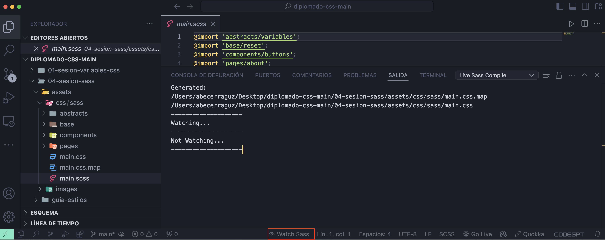

<section>


# IMPORTANTE
Antes de sumergirse en el mundo de Sass (Syntactically Awesome Stylesheets), es esencial tener un sólido conocimiento de CSS (Cascading Style Sheets). CSS es el lenguaje fundamental para describir la presentación de documentos HTML y es una habilidad básica para cualquier desarrollador web. Comprender los conceptos y la sintaxis de CSS, como selectores, propiedades, valores, y cómo se aplican los estilos a los elementos HTML, es crucial. Esta base no solo facilitará la transición a Sass, sino que también permitirá aprovechar al máximo las características avanzadas que Sass ofrece, como variables, anidación, y mixins. Por lo tanto, dominar CSS es un prerrequisito indispensable para aprender y utilizar Sass de manera efectiva.

Si aun tienes dudas del manejo de HTML y CSS te invito a que revises mi material de HTML5 y CSS3:

1. [Librería y Referencia de HTML y CSS.](https://abecerraguz.github.io/libreria-html/)
2. [Guía paso a paso cómo hacer una página Web.](https://github.com/abecerraguz/libreria-html-II)
3. [Videos Tutoriales Ejercicio HTML5 CSS3:](https://drive.google.com/drive/folders/1RF8_Xwe4taq1tugOlBXXAsH8Q-YRyKeE?usp=sharing)
    - [Wireframe Ejercicio HTML5 CSS3.](https://xd.adobe.com/view/f3b0e129-aaf4-4051-9f87-97967e6ee65e-a6e3/)
    - [Wireframe uso de grilla.](https://xd.adobe.com/spec/c4bab8ba-c793-48cc-46e8-53b02f2e266b-b28b/specs/)


## APUNTES SASS

Antes de comenzar a trabajar con Sass (Syntactically Awesome Stylesheets), es esencial preparar tu entorno de desarrollo para facilitar el proceso de compilación y obtener una experiencia más fluida. Una herramienta altamente recomendada para este propósito es la extensión "Live Sass Compiler" de Visual Studio Code. Esta extensión permite compilar archivos Sass/SCSS a CSS en tiempo real, lo que agiliza el flujo de trabajo y permite ver los cambios de estilo de inmediato.

Para instalar la extensión "Live Sass Compiler", sigue estos sencillos pasos:

1. Abre Visual Studio Code: Si aún no tienes instalado Visual Studio Code, descárgalo e instálalo desde code.visualstudio.com.

2. Accede a la extensión: Haz clic en el icono de extensiones en la barra lateral izquierda o usa el atajo de teclado `Ctrl+Shift+X` (o `Cmd+Shift+X` en Mac).

3. Busca "Live Sass Compiler": En la barra de búsqueda, escribe "Live Sass Compiler" y presiona Enter.

4. Instala la extensión: Encuentra la extensión en los resultados de búsqueda y haz clic en el botón de instalación.

5. Reinicia Visual Studio Code: Después de la instalación, es recomendable reiniciar Visual Studio Code para asegurar que la extensión se active correctamente.

Una vez instalada la extensión, podrás compilar tus archivos Sass/SCSS a CSS de manera automática y en tiempo real, simplificando el proceso de desarrollo y permitiéndote concentrarte en escribir código limpio y eficiente. Con esta configuración, estarás listo para aprovechar al máximo las capacidades de Sass y mejorar la calidad de tus proyectos de estilo.

[Puedes instalar la extensión desde aquí](https://marketplace.visualstudio.com/items?itemName=glenn2223.live-sass)

## QUE ES SASS Y PARA QUE SIRVE
Sass, que significa Syntactically Awesome Stylesheets, es un preprocesador de CSS que añade funcionalidades avanzadas a los estilos CSS, haciéndolos más poderosos y fáciles de mantener. Creado por Hampton Catlin y desarrollado por Natalie Weizenbaum, Sass permite utilizar características que no están disponibles en CSS tradicional, como variables, anidación, mixins, herencia y operadores.

## ¿Para qué sirve Sass?

1. `Variables`: Permiten almacenar valores que se utilizan repetidamente, como colores, tamaños de fuente o márgenes, lo que facilita la gestión y el cambio de estos valores en un solo lugar.

```scss

  $primary-color: #3498db;
  body {
    color: $primary-color;
  }

```

2. `Anidación`: Permite escribir CSS de una manera que refleja la estructura HTML, mejorando la legibilidad y organización del código.

```scss

    nav {
      ul {
        margin: 0;
        padding: 0;
        list-style: none;
      }
      li { display: inline-block; }
      a {
        text-decoration: none;
        &:hover { text-decoration: underline; }
      }
    }

```

3. `Mixins`: Son bloques de código que se pueden reutilizar en cualquier parte del archivo Sass, lo que ayuda a reducir la repetición y a mantener el código limpio.

```scss

    @mixin border-radius($radius) {
      -webkit-border-radius: $radius;
      -moz-border-radius: $radius;
      border-radius: $radius;
    }
    .box { @include border-radius(10px); }

```

4. `Extensión/Inherencia`: Permite compartir un conjunto de reglas CSS entre diferentes selectores, evitando la duplicación de código.

```scss

  .message {
    border: 1px solid #ccc;
    padding: 10px;
    color: #333;
  }
  .success { @extend .message; border-color: green; }
  .error { @extend .message; border-color: red; }

```

5. `Operadores`: Permiten realizar cálculos matemáticos directamente dentro del código CSS.

```scss

  .container {
    width: 100% / 3;
  }

```

6. Referencia al Selector Padre.

El uso más común del & es referenciar al selector padre en un contexto anidado. Esto es útil para aplicar pseudo-clases o pseudo-elementos, y mantener el código más limpio y legible.

```scss

    button {
      &:hover {
        background-color: blue;
      }
      &:active {
        background-color: red;
      }
    }

```

Este código Sass se compila en css:

```css

  button:hover {
    background-color: blue;
  }
  button:active {
    background-color: red;
}

```


Sass mejora significativamente la productividad y la organización del código CSS, haciéndolo más eficiente y fácil de mantener, especialmente en proyectos grandes y complejos.


## SASS EL PATRON 7/1 

Volvamos a la arquitectura, ¿de acuerdo? Normalmente suelo trabajar con lo que yo llamo el patrón 7-1: 7 carpetas, 1 archivo. Basicamente, tienes todas las partes almacenadas en 7 carpetas diferentes, y un único archivo en el directorio raíz (normalmente llamado main.scss) y que importa todas estas partes para luego compilarlas en una hoja de estilo CSS.

[Puedes ver el Patron 7/1](https://sass-guidelin.es/es/#arquitectura)

~~~


sass/
|
|– base/
|   |– _reset.scss       # Reset/normalize
|   |– _typography.scss  # Reglas tipográficas
|   …                    # Etc.
|
|– components/
|   |– _buttons.scss     # Botones
|   |– _carousel.scss    # Carousel
|   |– _cover.scss       # Cubierta
|   |– _dropdown.scss    # Dropdown
|   …                    # Etc.
|
|– layout/
|   |– _navigation.scss  # Navegación
|   |– _grid.scss        # Sistema de retícula
|   |– _header.scss      # Encabezamiento
|   |– _footer.scss      # Pie de página
|   |– _sidebar.scss     # Barra lateral
|   |– _forms.scss       # Formularios
|   …                    # Etc.
|
|– pages/
|   |– _home.scss        # Estilos específicos para la página de inicio
|   |– _contact.scss     # Estilos específicos para la página de contacto
|   …                    # Etc.
|
|– themes/
|   |– _theme.scss       # Tema por defecto
|   |– _admin.scss       # Tema del administrador
|   …                    # Etc.
|
|– utils/
|   |– _variables.scss   # Variables Sass
|   |– _functions.scss   # Funciones Sass
|   |– _mixins.scss      # Mixins Sass
|   |– _helpers.scss     # Clases & placeholders
|
|– vendors/
|   |– _bootstrap.scss   # Bootstrap
|   |– _jquery-ui.scss   # jQuery UI
|   …                    # Etc.
|
|

– main.scss             # Archivo principal de Sass
~~~

## PARA IMPORTAR LOS PARCIALES

- @import 'abstracts/variables';
- @import 'abstracts/mixins';
- @import 'base/base';
- @import 'base/reset';
- @import 'base/typography';
- @import 'layout/header';
- @import 'layout/main-section.scss';
- @import 'layout/forms';
- @import 'components/buttons';
- @import 'components/inputs';
- @import 'pages/home';
- @import 'pages/contact';
- @import 'themes/theme';
- @import 'themes/admin';

## REALIZAR LA COMPILACIÓN
- Para realizar la compilación del archivo `.scss`, se debe hacer click en `Watch Sass`.



## BEM / Bloque, Elemento, Modificador.

BEM constituye la metodología que usaremos para nombrar y clasificar selectores CSS de manera estricta, transparente e informativa. Este método se basa en __nombrar las clases en un modo muy específico, ayudándonos a distinguir de manera simple de qué objeto hablamos y si tiene o no aplicado algún tipo de modificador en su estilo, ya sea por interacción del usuario, o por tipología del objeto.__ Cuando utilicemos la metodología BEM, deberemos tener en cuenta que solamente usaremos nombres de clases, nunca IDs, para fomentar así la reutilización de código.


## Como su nombre indica, BEM distingue claramente 3 conceptos: el Bloque, el Elemento y el Modificador.

## El Bloque
Representa la entidad independiente y unica, es decir, el `objeto al que aplicar el estilo.` Un bloque puede componerse de otros bloques. Un buscador simple es un bloque simple, mientras que la cabecera de una web es un bloque compuesto.

Para ejemplificarlo pensaremos en la cabecera de una web: pondremos la clase de nuestro bloque como:
~~~
.main-header
~~~

## El Elemento
Figura como una pieza concreta, de un Bloque cualquiera, que cumple una función. Evidentemente, un bloque puede estar compuesto de varios elementos. Las clases con las que identificamos cada elemento las escribiremos después del nombre del bloque, y las separaremos con dos guiones bajos:
~~~
.bloque__element
~~~
~~~
.main-header__brand
.main-header__primary-nav
.main-header__recursive-nav
.main-header__lang-chooser
~~~

## El Modificador
Son las entidades que usaremos para definir la apariencia o comportamiento de un Bloque o Elemento concreto. Su uso es opcional, pero nos será muy útil para separar claramente el objeto de su estilo gráfico.

Ejemplo de Modificador podemos tener un Menu de navegación que es un bloque que esta situado en el header, en si es un objeto único , pero tambien lo deseamos integrar en el footer, es ahí donde aparencen los modificadores, __recuerden los modificadores son aplicables tanto para los Bloques como para los elementos"__ Ejemplo:

~~~
.main-menu (bloque)
.main-menu-item (elementos __ )
.main-menu--footer (modificador --)
~~~

Los Modificadores los representaremos con doble guión, ejemplo:

~~~
main-header__lang-chooser
main-header__lang-chooser—-isOpen
~~~

## EJEMPLO


Los botones y el logo, están metidos en un bloque. (borde rojo)
Este bloque no depende de ningún otro elemento. Se puede poner en cualquier parte de la página y no cambia en nada.

Ahora analizemos los botones.
Estos 3 botones comparten ciertas características.

-El padding es el mismo.
-El margen es el mismo.
-El tipo de letra es el mismo.
-El tamaño de letra es el mismo.

Cada botón es un elemento. El elemento SI depende del bloque en el que se inserte. Esto significa que por sí solo, el elemento no tiene un significado particular.

Podemos decir que el Element sería como el conjunto de reglas comunes para los botones.
Sin embargo, hay algunas cosas que cambian de forma individual.

El color de la letra.

El color de fondo del botón.
Modifier sería reglas particulares de cada elemento.


## Reglas de escritura CSS en BEM

Para el bloque solo lo escribimos como si fuera una clase normal:
~~~
.bloque{
}
~~~

Como vimos arriba, el elemento tiene que ser parte de un bloque. Entonces usamos doble guión bajo para separar el nombre del bloque del elemento. Para el caso del menú y botones. Sería algo así

~~~
.bloque__boton{
}
~~~

Los modificadores, son parte del elemento (y del bloque), por lo que para separar el modificador del elemento se usa el doble guión corto “ — ”. Para el ejemplo de los botones de arriba, seria algo asi.

~~~
.bloque__boton--rojo{
}
~~~

## Ejemplo de SCSS
~~~

.section-wrapper {
  font-family: $primary-font;
  font-weight: $primary-font-regular;
  margin: 0 auto;
  width: 80%;
}

.nosotros{
  @extend .section-wrapper;
  background-color: $jean-bean;
  color: $white;
  display: table;
  font-size: $font-size-large;
  padding: 150px 0;
  text-align: center;

  &__title {
    display: table-cell;
    font-weight: $primary-font-extra-light;
    vertical-align: middle;

    &--highlighted-text {
      font-weight: $primary-font-bold;
      text-transform: uppercase;
    }
  }
}
~~~

# Bloque Elemento Modificador (Complementando tu aprendizaje)

Bem nace por la necesidad de reutilización de un módulo en cualquier otro proyecto, si utilizamos la forma tradicional de estructurar CSS es poco probable que podamos tomar el bloque del form (Ejemplo a continuación) y dejarlo en cualquier otro proyecto y este mantenga su aspecto. Par esto Bem nos invita a segmentar las distintas secciones de una página HTML e identificarlas como bloques. 

## HTML sin BEM
~~~
<form id="search">

  <div class="content">

  <input type="text" class="input">
  <button class="buttom disable">Search</button>

  </div>

</form>
~~~

## CSS sin BEM
~~~
#search {}
#search .content {}
#search .content .input {}
#search .content .button {}
#search .content .button.disable {}
~~~

## Bloque Elemento Modificador
Preguntas que debes hacerte para asignar los nombres a las clases
~~~
BLOQUE      :¿Qué es ? Un formulario de búsqueda, importante el bloque es una entidad independiente.
ELEMENTO    :¿Cuál es su función? Contener los elementos de interacción, Elemento son hijos del bloque.
MODIFICADOR :¿Cuál es su apariencia, estado o comportamiento?
~~~

## CSS con BEM
~~~
BLOQUE      :nombrebloque
ELEMENTO    :nombrebloque__nombreElemento
MODIFICADOR :nombrebloque__nombreElemento--nombreModificador
~~~
~~~
<form class="searchform">

  <div class="searchform__content">

  <input type="text" class="searchform__input">
  <button class="searchform__button searchform__buttondisable">Search</button>

  </div>

</form>
~~~


</section>